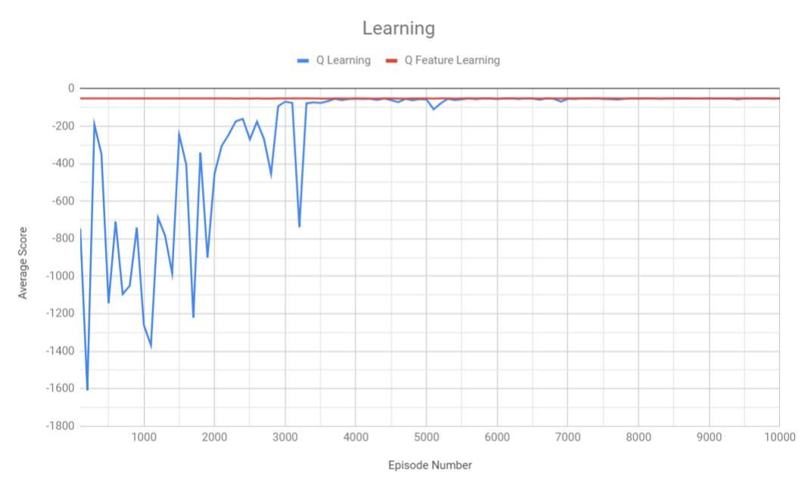

CS419 - Machine Learning Assignment 05
======================================

###Author###
Julia Froegel

###Description###
Implemented Q Learning and Feature Q Learning in pipe_world.txt located at top level

###Content###
- src
     - FeatQLearning.java
     - QLearning.java
     - QLearningDriver.jave
- Text
     - pol.txt
          - learned policies
     - analysis.txt
          - analysis
- LearningGraph.jpg
- pipe_world.txt

###Graph###

